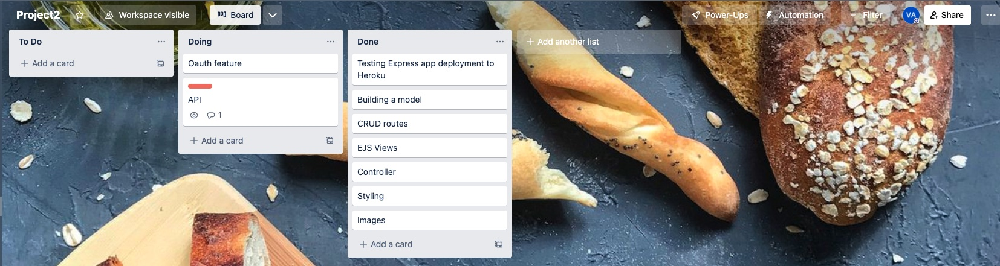

Details for CRUD-Bakery app/project

# Introduction
This app is listing most popular pastries and can be used to order pastries directly from the app (is going to hopefully).

# Technical requirements
This app 
-   is in line with CRUD requirements (tested for all four succefully)
-   has two entities (Pastries and reviews associated if any)
-   is connected to MongoDB cloud
-   deployed to Heroku

# How to run the app
App can be ran via Heroku using the following link: <a href="https://crud-bakery-new.herokuapp.com/">Click Here</a>

# Screenshot of the home page and Trello progress

